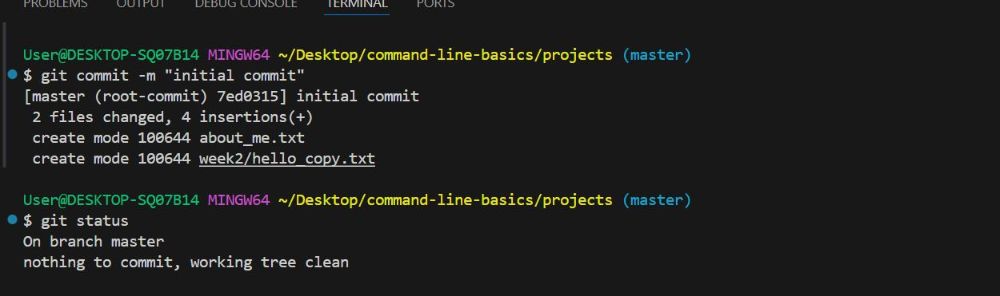

# Git and GitHub Basics Assignment

**1. Initialize a Git repository:**

To initialize a git repository, I opened my directory in my list week folder on my local pc and initialize git repository using the command.

"git init".

**2. Add and commit files:**

To add all files to the staging area, i used the command,

"git add ."

I commit the files with a message using this command,

"git commit -m "initial commit".

**3. Push to GitHub:**

Firstly, i went to my Github account and created a repository named "my-first-project".
Secondily, I linked the local repository to the remote using the command,

"git remote add origin my https://github.com/Sprazitech/command-line-basic.git".

Lastly, I pushed the changes made using command,

"git push -u origin main".

**NOTE:** When I pushed the above command, an error notice popped up. To solve the error, Git recommended using the command "git push --set-upstream origin master".
I noticed my changes was not pushed to my main but instead it created a branch "master" where it was pushed to.

**4. Practice cloning:**

To be able to clone "my-first-project" repository, I created a new folder, then I "cd" into the new created folder to clone my repository using this command,
"git clone https://github.com/Sprazitech/command-line-basic.git".

**5. Modify and push:**

I Added a new file named "goals.txt" listing your programming goals using the command,

"touch goals.txt".

I used the command "cat goals.txt" to view my message and I committed my goals.txt file using the command, "git commit -m "list of my programming goals."

Lastly, I pushed the changes to GitHub using command "git push"

